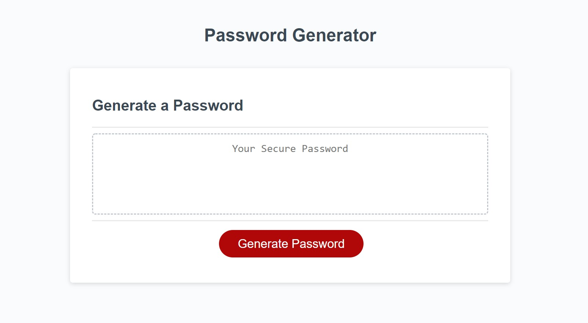
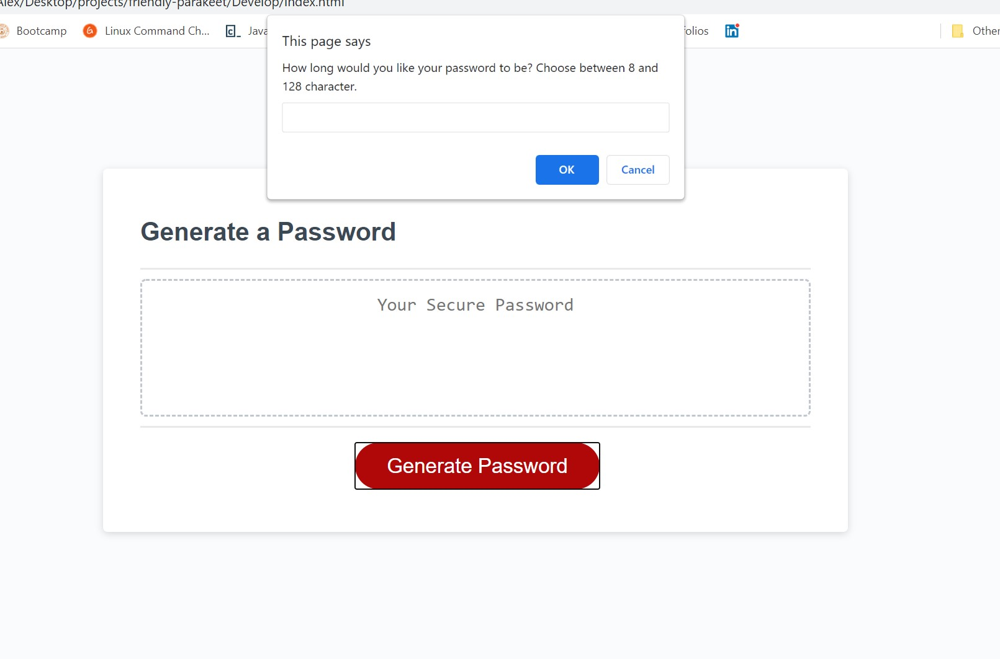
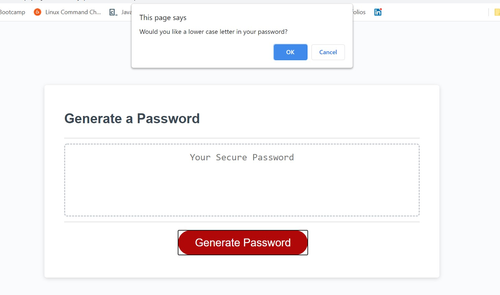
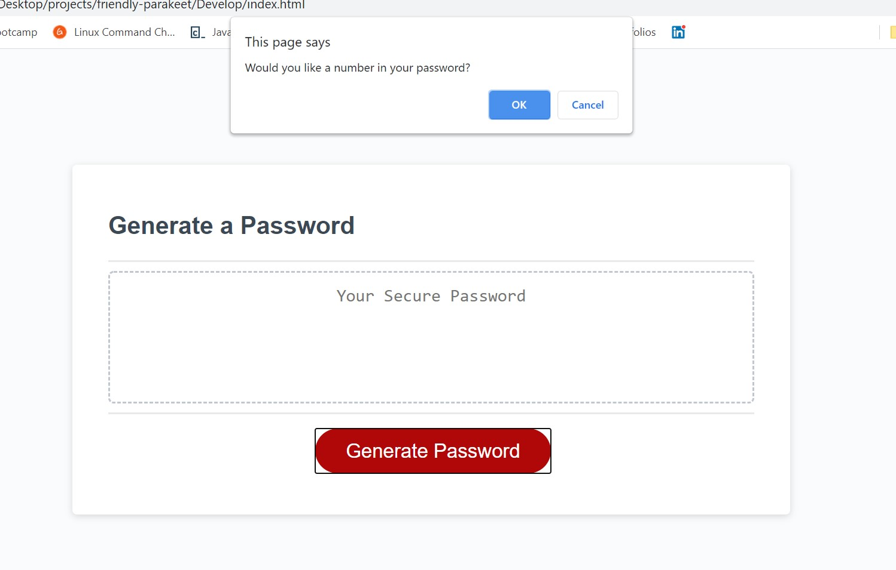
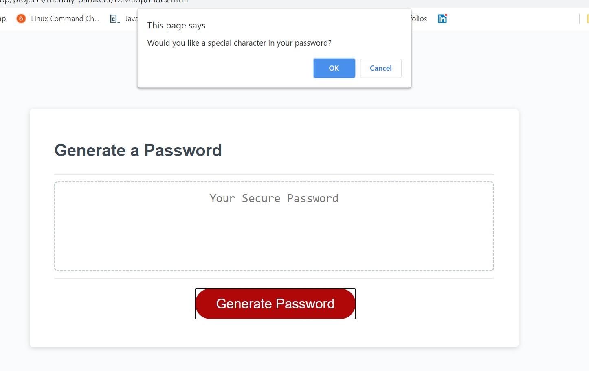
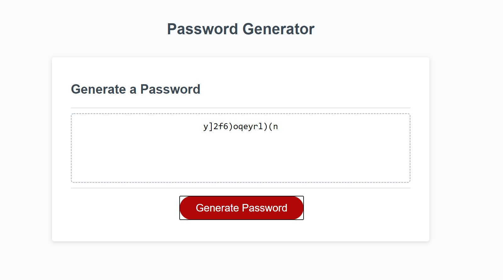

# Password Generator - Assignment 3

For our second assignment, we were tasked with creating a password generator using the following User Story and Criteria.

## User Story
AS AN employee with access to sensitive data

I WANT to randomly generate a password that meets certain criteria

SO THAT I can create a strong password that provides greater security

## Acceptance Criteria
GIVEN I need a new, secure password

WHEN I click the button to generate a password
THEN I am presented with a series of prompts for password criteria

WHEN prompted for password criteria
THEN I select which criteria to include in the password

WHEN prompted for the length of the password
THEN I choose a length of at least 8 characters and no more than 128 characters

WHEN prompted for character types to include in the password
THEN I choose lowercase, uppercase, numeric, and/or special characters

WHEN I answer each prompt
THEN my input should be validated and at least one character type should be selected

WHEN all prompts are answered
THEN a password is generated that matches the selected criteria

WHEN the password is generated
THEN the password is either displayed in an alert or written to the page

## Screen Shots

## Prompted to "Generate Password"

## Asked for length between 8 and 128 characters

## Would you like uppercase?

## Would you like lowercase?

## Would you like numbers?

## Would you like special characters?

## Finally, password is generated!

